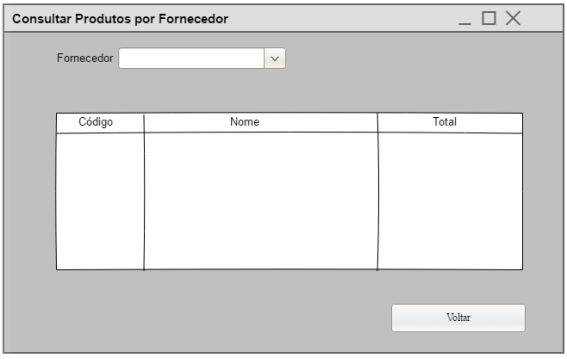
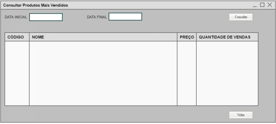
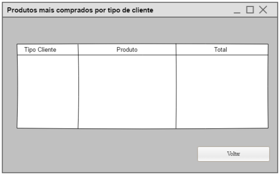
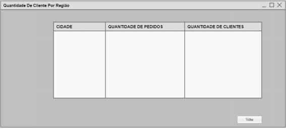
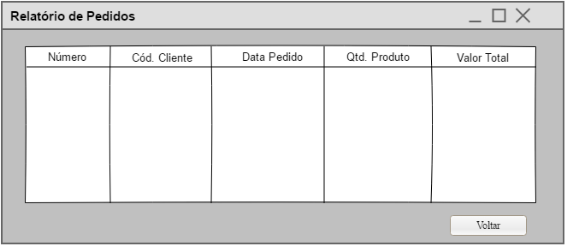
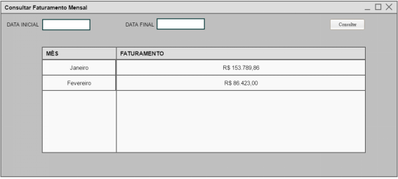
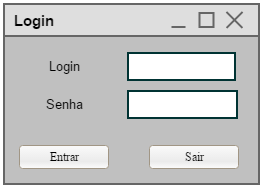

## USANDO O PADRÃO NESMA FPA COM O COCOMO II PARA DIMENSIONAMENTO DO ESFORÇO DE DESENVOLVIMENTO DE SOFTWARE

Página criada com o objetivo de expor a prototipação das telas do Sistema de Gerenciamento de Compras, esse sistema foi utilizado para realizar a contagem de pontos de função usando o modelo NESMA/FPA e COCOMO II.

A prototipação do sistema utilizado no artigo desenvolvido pelos alunos de graduação do curso de Sistemas de Informação da Faculdade Metodista Granbery estão abaixo:

### Menu

### Produto

### Cliente

### Pedido

### Usuario

